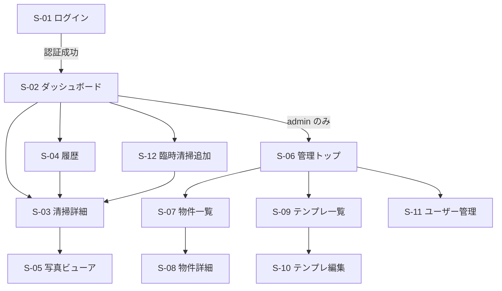

# 民泊清掃スケジュール・チェックリストアプリ 基本設計書

- ドキュメント種別: 基本設計書
- プロジェクト名: cleaning_schedule
- 作成日: 2026-09-07 / 版: 0.5
- 前提ドキュメント: 01_要件定義書.md（v1.0 承認済み）

---

## 1. アーキテクチャ概要

```
[スマホ / PWA]
   │  HTTPS
   ▼
[Cloudflare Workers]  ── Hono（ルーティング / 認証 / SSR）
   │            │
   │            ├─▶ [D1]  予約・清掃・チェック・テンプレ・ユーザー・ログ
   │            └─▶ [R2]  写真バイナリ（フル / サムネイル）
   │
[Cron Trigger（3時間ごと）] ─▶ Worker の scheduled ハンドラ ─▶ iCal 取得 → D1 反映
   │
[Airbnb iCal（物件ごとの URL）]
```

- 単一の Cloudflare Worker にすべてを集約（フロント配信・API・Cron）。
- 画面はサーバーサイドレンダリング（Hono + テンプレート文字列）。
  チェック操作・写真アップロードなど一部だけクライアント JS で非同期化。
- ビルド工程なし。`wrangler deploy` のみでデプロイ。

### 1.1 技術スタック

| 区分 | 採用 | 備考 |
|---|---|---|
| 実行環境 | Cloudflare Workers | 既存。`compatibility_date` 2026-09-01 |
| フレームワーク | Hono 4.x（`hono` npm、現行 4.13） | ルーティング / `hono/cookie` / ミドルウェア |
| DB | Cloudflare D1（SQLite） | バインディング名 `DB` |
| 写真バイナリ | D1（`photo_blob` テーブル） | MVP は D1。将来 R2（binding `PHOTOS`）へ移行（§7.4） |
| 静的資産 | Workers Assets（`public/`） | アイコン・SW・クライアント JS/CSS |
| スケジュール | Workers Cron Triggers | `0 */3 * * *` |
| 認証 | 自前（PIN + HMAC 署名 cookie） | 外部 IdP なし |
| パスワードハッシュ | WebCrypto PBKDF2-SHA256 | ソルト付き。ログイン試行制限併用 |

### 1.2 ディレクトリ構成（予定）

```
cleaning_schedule/
├── src/
│   ├── index.js            エントリ（fetch / scheduled）
│   ├── app.js              Hono アプリ本体・ルート登録
│   ├── auth.js             ログイン・cookie 署名・認証ミドルウェア
│   ├── db/
│   │   ├── schema.sql      DDL（マイグレーション 0001）
│   │   ├── migrations/     0002_*.sql ...
│   │   └── queries.js      D1 アクセス関数
│   ├── ical/
│   │   ├── parser.js       iCalendar パーサ
│   │   └── sync.js         同期処理（予約→清掃生成）
│   ├── photos.js           R2 保存・配信・削除
│   ├── views/              HTML レンダリング関数
│   │   ├── layout.js
│   │   ├── dashboard.js
│   │   ├── cleaning.js
│   │   ├── history.js
│   │   └── admin/*.js
│   └── lib/                日時（Asia/Tokyo）・ID 生成・バリデーション
├── public/
│   ├── app.js             クライアント JS（チェック更新・画像リサイズ）
│   ├── app.css
│   ├── sw.js              Service Worker
│   ├── manifest.webmanifest
│   └── icons/*.png
├── wrangler.jsonc
├── package.json
└── docs/
```

### 1.3 コスト（開発・運用とも無料枠内 / 月額 $0）

想定規模: 物件 〜10、清掃 〜100件/月、利用者 4名。

| サービス | 無料枠（目安） | 見込み利用 | 費用 |
|---|---|---|---|
| Workers 実行 | 100,000 リクエスト/日、Cron 込み | 数百〜数千/日 | $0 |
| Workers 静的配信 | 無制限 | JS/CSS/アイコン | $0 |
| D1 | ストレージ 5GB / 読取 500万行・日 / 書込 10万行・日 | ごくわずか（写真 BLOB 含む） | $0 |
| Cron Triggers | 無料プランに含まれる | 3時間ごと | $0 |
| ドメイン | `*.workers.dev` サブドメイン無料 | それを使用 | $0 |
| R2 | （当面未使用） | — | — |

- **Workers 有料プラン（$5/月）は不要。**
- カード登録は不要（R2 を使わないため）。
- 独自ドメインを使う場合のみドメイン代（年 $10 前後）が別途発生するが必須ではない。
- 写真を D1 に保存するため DB 容量が増える。上限は 10GB、無料枠は 5GB。
  ペースを見て R2 有効化・移行を判断（§7.3 / §7.4）。移行後も R2 無料枠内で $0 の見込み。
- 無料枠を超えた場合: Workers は 429 を返す（課金なし）。D1 超過分のみ従量課金の可能性 →
  その前に R2 移行する運用とする。

---

## 2. 画面設計

### 2.1 画面一覧

| ID | 画面 | パス | 権限 | 概要 |
|---|---|---|---|---|
| S-01 | ログイン | `/login` | 公開 | ユーザー選択 + PIN 入力 |
| S-02 | ダッシュボード | `/` | member | 全物件横断の今後 / 直近の清掃カード |
| S-03 | 清掃詳細 | `/cleanings/:id` | member | チェックリスト・写真・開始/完了・メモ |
| S-04 | 履歴 | `/history` | member | 過去清掃の一覧（物件・期間で絞り込み） |
| S-05 | 写真ビューア | `/photos/:id`（`?view=1` で拡大ページ） | member | 拡大表示 |
| S-06 | 管理トップ | `/admin` | admin | 各管理画面への入口・同期状況 |
| S-07 | 物件一覧 / 追加 | `/admin/properties` | admin | 物件の CRUD |
| S-08 | 物件詳細 | `/admin/properties/:id` | admin | iCal URL・テンプレ割当・手動同期 |
| S-09 | テンプレート一覧 | `/admin/templates` | admin | ベース / 物件別テンプレ一覧 |
| S-10 | テンプレート編集 | `/admin/templates/:id` | admin | エリア・項目の追加/編集/削除/並替 |
| S-11 | ユーザー管理 | `/admin/users` | admin | 追加・権限変更・PIN リセット・無効化 |
| S-12 | 臨時清掃の追加 | `/cleanings/new` | member | 物件・日付を指定して手動作成 |

### 2.2 画面遷移



### 2.3 主要画面のレイアウト方針

- モバイル縦画面を基準（幅 360〜430px）。1カラム。上部に固定ヘッダー（アプリ名 + 現在ユーザー）。
- 下部にタブバー: 「清掃」「履歴」／admin は「管理」を追加。
- タップ領域は最小 44px。チェック項目は行全体をタップ可能に。
- カラー: テーマカラー1色 + 状態色（未着手=グレー / 作業中=オレンジ / 完了=グリーン）。
- S-03 は「エリア（部屋）」ごとの折りたたみセクション。各セクションに進捗（3/5）。

---

## 3. データモデル詳細（D1 / SQLite）

方針:

- 主キーは `INTEGER PRIMARY KEY`（内部 4 名利用のため列挙リスクは許容）。
- 日付は `TEXT`（`YYYY-MM-DD`）、日時は `TEXT`（ISO8601 UTC, 例 `2026-09-07T04:30:00Z`）。
- 表示は Asia/Tokyo に変換（`lib/datetime`）。
- 真偽値は `INTEGER`（0/1）。
- 外部キーは論理的に維持（D1 で `PRAGMA foreign_keys` は有効化する）。

### 3.1 DDL（マイグレーション 0001_init.sql）

```sql
PRAGMA foreign_keys = ON;

-- ユーザー（初期は空。各自が /register でセルフ登録。§6.1）
CREATE TABLE user (
  id           INTEGER PRIMARY KEY,
  name         TEXT    NOT NULL,
  role         TEXT    NOT NULL DEFAULT 'member' CHECK (role IN ('admin','member')),
  pin_hash     TEXT    NOT NULL,          -- pbkdf2$<iter>$<salt_b64>$<hash_b64>
  active       INTEGER NOT NULL DEFAULT 1,
  failed_count INTEGER NOT NULL DEFAULT 0,
  locked_until TEXT,                      -- ISO8601、ログイン試行制限
  created_at   TEXT    NOT NULL
);

-- チェックリストテンプレート（is_base=1 は共通ベース。物件用は property_id を持つ）
CREATE TABLE checklist_template (
  id          INTEGER PRIMARY KEY,
  name        TEXT    NOT NULL,
  is_base     INTEGER NOT NULL DEFAULT 0,
  property_id INTEGER REFERENCES property(id) ON DELETE CASCADE,
  created_at  TEXT    NOT NULL,
  updated_at  TEXT    NOT NULL
);

CREATE TABLE checklist_template_item (
  id          INTEGER PRIMARY KEY,
  template_id INTEGER NOT NULL REFERENCES checklist_template(id) ON DELETE CASCADE,
  area_label  TEXT    NOT NULL,           -- 部屋 / エリア（例「リビング」「浴室」）
  sort_order  INTEGER NOT NULL DEFAULT 0,
  item_key    TEXT    NOT NULL,           -- テンプレ内で一意な安定キー
  label       TEXT    NOT NULL,
  needs_photo INTEGER NOT NULL DEFAULT 0,
  note        TEXT
);
CREATE INDEX idx_tpl_item_tpl ON checklist_template_item(template_id, sort_order);

-- 物件
CREATE TABLE property (
  id            INTEGER PRIMARY KEY,
  name          TEXT    NOT NULL,
  ical_url      TEXT    NOT NULL,         -- 機微。UI ではマスク表示、ログ出力禁止
  active        INTEGER NOT NULL DEFAULT 1,
  checkout_time TEXT    NOT NULL DEFAULT '10:00',
  template_id   INTEGER REFERENCES checklist_template(id),
  note          TEXT,
  created_at    TEXT    NOT NULL
);

-- 予約（iCal 同期の結果）
CREATE TABLE reservation (
  id            INTEGER PRIMARY KEY,
  property_id   INTEGER NOT NULL REFERENCES property(id) ON DELETE CASCADE,
  ical_uid      TEXT    NOT NULL,
  checkin_date  TEXT    NOT NULL,         -- YYYY-MM-DD
  checkout_date TEXT    NOT NULL,         -- YYYY-MM-DD（清掃日）
  guest_hint    TEXT,                     -- 電話下4桁など取得できた範囲
  status        TEXT    NOT NULL DEFAULT 'active' CHECK (status IN ('active','cancelled')),
  raw_text      TEXT,                     -- VEVENT 原文（画面非表示）
  synced_at     TEXT    NOT NULL,
  UNIQUE (property_id, ical_uid)
);
CREATE INDEX idx_resv_prop_checkout ON reservation(property_id, checkout_date);

-- 清掃タスク
CREATE TABLE cleaning (
  id             INTEGER PRIMARY KEY,
  property_id    INTEGER NOT NULL REFERENCES property(id) ON DELETE CASCADE,
  reservation_id INTEGER REFERENCES reservation(id) ON DELETE SET NULL,
  clean_date     TEXT    NOT NULL,        -- YYYY-MM-DD
  source         TEXT    NOT NULL DEFAULT 'ical' CHECK (source IN ('ical','manual')),
  status         TEXT    NOT NULL DEFAULT 'pending'
                 CHECK (status IN ('pending','in_progress','done','cancelled')),
  started_by     INTEGER REFERENCES user(id),
  started_at     TEXT,
  completed_by   INTEGER REFERENCES user(id),
  completed_at   TEXT,
  note           TEXT,
  created_at     TEXT    NOT NULL,
  UNIQUE (property_id, clean_date, reservation_id)
);
CREATE INDEX idx_cleaning_date ON cleaning(clean_date);
CREATE INDEX idx_cleaning_prop_status ON cleaning(property_id, status);

-- チェック項目（テンプレからスナップショット生成。以後テンプレ変更の影響なし）
CREATE TABLE checklist_item (
  id          INTEGER PRIMARY KEY,
  cleaning_id INTEGER NOT NULL REFERENCES cleaning(id) ON DELETE CASCADE,
  area_label  TEXT    NOT NULL,
  sort_order  INTEGER NOT NULL DEFAULT 0,
  item_key    TEXT    NOT NULL,
  label       TEXT    NOT NULL,
  needs_photo INTEGER NOT NULL DEFAULT 0,
  note        TEXT,
  checked     INTEGER NOT NULL DEFAULT 0,
  checked_by  INTEGER REFERENCES user(id),
  checked_at  TEXT
);
CREATE INDEX idx_item_cleaning ON checklist_item(cleaning_id, sort_order);

-- 写真（メタデータ）
CREATE TABLE photo (
  id                INTEGER PRIMARY KEY,
  property_id       INTEGER NOT NULL REFERENCES property(id) ON DELETE CASCADE,
  cleaning_id       INTEGER NOT NULL REFERENCES cleaning(id) ON DELETE CASCADE,
  checklist_item_id INTEGER REFERENCES checklist_item(id) ON DELETE SET NULL,
  storage           TEXT    NOT NULL DEFAULT 'd1' CHECK (storage IN ('d1','r2')),
  r2_key            TEXT,                 -- storage='r2' のとき フル画像キー
  r2_thumb_key      TEXT,                 -- storage='r2' のとき サムネキー
  content_type      TEXT    NOT NULL DEFAULT 'image/jpeg',
  size_bytes        INTEGER,              -- フル画像のバイト数
  caption           TEXT,
  uploaded_by       INTEGER NOT NULL REFERENCES user(id),
  uploaded_at       TEXT    NOT NULL
);
CREATE INDEX idx_photo_cleaning ON photo(cleaning_id);
CREATE INDEX idx_photo_storage ON photo(storage);

-- 写真バイナリ（MVP: D1 保存。R2 移行後にテーブルごと廃止予定。§7.4）
CREATE TABLE photo_blob (
  photo_id INTEGER NOT NULL REFERENCES photo(id) ON DELETE CASCADE,
  kind     TEXT    NOT NULL CHECK (kind IN ('full','thumb')),
  bytes    BLOB    NOT NULL,
  PRIMARY KEY (photo_id, kind)
);

-- 同期ログ
CREATE TABLE sync_log (
  id                INTEGER PRIMARY KEY,
  property_id       INTEGER REFERENCES property(id) ON DELETE CASCADE,
  run_at            TEXT    NOT NULL,
  result            TEXT    NOT NULL CHECK (result IN ('ok','error')),
  reservations_seen INTEGER NOT NULL DEFAULT 0,
  cleanings_created INTEGER NOT NULL DEFAULT 0,
  cleanings_updated INTEGER NOT NULL DEFAULT 0,
  message           TEXT
);
CREATE INDEX idx_synclog_prop_time ON sync_log(property_id, run_at DESC);

-- 設定 / メタ（Key-Value）
CREATE TABLE app_meta (
  key   TEXT PRIMARY KEY,
  value TEXT
);

-- 初期データ（マイグレーション 0001 の末尾に含める）
INSERT INTO app_meta (key, value) VALUES
  ('registration_open', '1'),
  ('max_users', '4'),
  ('schema_version', '1');

-- ベーステンプレの雛形（実項目は運用開始後に admin が UI で追加）
INSERT INTO checklist_template (name, is_base, property_id, created_at, updated_at)
  VALUES ('標準ベース', 1, NULL, strftime('%Y-%m-%dT%H:%M:%SZ','now'),
                                 strftime('%Y-%m-%dT%H:%M:%SZ','now'));
```

### 3.2 補足ルール

- **テンプレ展開（清掃生成時）**: `cleaning` 作成時に `property.template_id` の
  `checklist_template_item` を全件コピーして `checklist_item` を作る。
  以後テンプレを編集しても既存 `cleaning` は不変（要件 FR-10）。
- **予約変更の反映**:
  - 日程変更（同 `ical_uid` の `checkout_date` 変更）→ 対応する未完了 `cleaning.clean_date` を更新。
    完了済みなら更新せずログに残す。
  - 予約消滅（同期時に iCal から消えた `active` 予約）→ `reservation.status='cancelled'`、
    未着手 `cleaning` は `status='cancelled'`。作業中/完了は維持しログ記録。
- **セッション**: サーバー側テーブルを持たず、署名 cookie に `uid` と `exp` を格納（§6）。

---

## 4. API / ルート仕様

共通:

- 認証必須ルートは未ログイン時 `302 /login?next=<path>`。
- 変更系はフォーム POST（`application/x-www-form-urlencoded`）または `fetch` + JSON。
- CSRF 対策: 署名 cookie は `SameSite=Lax` + 変更系 POST は Origin 同一チェック + double-submit cookie（`csrf` cookie とフォーム隠し `_csrf` の一致を検証）。
- レスポンスは画面遷移は HTML、非同期操作は JSON（`{ok:true,...}`）。

### 4.1 認証・登録

| メソッド | パス | 説明 |
|---|---|---|
| GET | `/login` | ユーザー選択 + PIN 入力フォーム（登録済みユーザーがいない場合は `/register` へ誘導） |
| POST | `/login` | `user_id`,`pin` を検証 → 署名 cookie 発行 → `next` へ |
| POST | `/logout` | cookie 破棄 |
| GET | `/register` | セルフ登録フォーム。`?token=<SETUP_TOKEN>` 必須（または admin が発行した招待リンク） |
| POST | `/register` | `name`,`pin`,`pin2` を検証 → `user` 追加。ロール決定は §6.1 |

登録は「各自が後日登録」する運用（01 FR-35a 改）。詳細は §6.1。

### 4.2 清掃

| メソッド | パス | 説明 |
|---|---|---|
| GET | `/` | ダッシュボード（`?property=` で絞り込み） |
| GET | `/cleanings/:id` | 清掃詳細 |
| POST | `/cleanings/:id/start` | `status: pending→in_progress`、`started_by/at` 記録 |
| POST | `/cleanings/:id/complete` | 必須項目クリア確認 → `in_progress→done` |
| POST | `/cleanings/:id/reopen` | `done→in_progress`（誤操作対応） |
| POST | `/cleanings/:id/note` | メモ更新 |
| POST | `/cleanings/:id/items/:itemId/toggle` | チェック ON/OFF、`checked_by/at` 記録（JSON） |
| GET | `/cleanings/new` / POST `/cleanings` | 臨時清掃の作成（`property_id`,`clean_date`） |
| GET | `/history` | 履歴（`?property=&from=&to=`） |

### 4.3 写真

| メソッド | パス | 説明 |
|---|---|---|
| POST | `/cleanings/:id/photos` | multipart。`full`（必須）,`thumb`（任意）,`item_id`,`caption` |
| GET | `/photos/:id` | フル画像を配信（認証チェック後 R2 から stream） |
| GET | `/photos/:id?thumb=1` | サムネイル配信 |
| GET | `/photos/:id?view=1` | 拡大表示 HTML ページ |
| POST | `/photos/:id/delete` | アップロード者本人 or admin |

### 4.4 管理（admin のみ）

| メソッド | パス | 説明 |
|---|---|---|
| GET | `/admin` | 概要・各物件の最終同期状況 |
| GET/POST | `/admin/properties` , `/admin/properties/:id` | 物件 CRUD |
| POST | `/admin/properties/:id/sync` | 当該物件を即時同期 |
| POST | `/admin/sync-all` | 全物件を即時同期 |
| GET/POST | `/admin/templates` , `/admin/templates/:id` | テンプレ CRUD |
| POST | `/admin/templates/:id/items` , `/admin/templates/:id/items/:iid` | 項目の追加/更新/削除 |
| POST | `/admin/templates/:id/reorder` | 並べ替え（`item_id[]` の順序） |
| POST | `/admin/templates/:id/clone` | 複製（新規物件の初期テンプレ用） |
| GET/POST | `/admin/users` , `/admin/users/:id` | ユーザー管理 |
| POST | `/admin/users/:id/reset-pin` | PIN リセット（新 PIN を1回だけ表示） |

### 4.5 システム

| メソッド | パス | 説明 |
|---|---|---|
| GET | `/manifest.webmanifest` , `/sw.js` , `/icons/*` | PWA 資産（公開） |
| GET | `/healthz` | 死活確認（公開、DB 疎通のみ） |
| (cron) | `scheduled()` | 全 `active` 物件の同期を実行 |

---

## 5. iCal 同期処理設計

### 5.1 フロー

1. 対象物件を取得（`active=1`）。
2. `fetch(ical_url)`（UA 指定、タイムアウト 20s、最大 2 リトライ）。
3. 本文を `ical/parser` で VEVENT 配列へ。
   - 行連結（`CRLF + 空白` の折り返し解除）、`KEY;PARAMS:VALUE` 分解、`DTSTART/DTEND/UID/SUMMARY/DESCRIPTION` 抽出。
4. イベント分類:
   - **予約**: `SUMMARY` が `Reserved` を含む、または `DESCRIPTION` に予約詳細 URL を含む。
   - **ブロック**: `SUMMARY` が `Airbnb (Not available)` 等 → スキップ。
5. 予約ごとに `reservation` を upsert（キー: `property_id + ical_uid`）。
   - `checkout_date = DTEND`（`VALUE=DATE` は終了日排他だが Airbnb はチェックアウト日そのものを入れる。実データで最終確認）。
   - `guest_hint`: `DESCRIPTION` から電話末尾4桁など抽出できれば格納。
6. iCal に現れなかった既存 `active` 予約 → `cancelled` 化 + 清掃キャンセル処理。
7. 予約 → 清掃生成:
   - 未来〜過去数日の `checkout_date` について `cleaning` が無ければ作成し、テンプレ展開。
   - 既存があり日程変更なら未完了分の `clean_date` を更新。
8. `sync_log` に結果を記録。

### 5.2 スケジュールと冪等性

- Cron: `0 */3 * * *`（3時間ごと）。手動同期も同じ関数を呼ぶ。
- すべて upsert / 存在チェックで冪等。二重生成は `cleaning` の UNIQUE 制約で防止。
- 生成対象の日付範囲: `今日 - 3日` 〜 `今日 + 180日`。

### 5.3 実データ確認事項（実装時にパーサで検証）

- Airbnb iCal の予約イベントの `SUMMARY` 実値（"Reserved" / "Airbnb (Not available)" など）。
- `DESCRIPTION` に含まれる情報（予約 URL、電話下4桁の有無）。
- `DTEND` がチェックアウト日か翌日か。
- タイムゾーン指定（通常 `VALUE=DATE` の終日イベント）。

---

## 6. 認証・セッション設計

### 6.1 セルフ登録（初期ユーザーは各自が後日登録）

- 事前投入はしない。デプロイ直後は `user` テーブルが空。
- **登録経路**: `/register?token=<SETUP_TOKEN>`。
  - `SETUP_TOKEN` は `wrangler secret put SETUP_TOKEN` で設定し、管理者が4名に登録用URLを共有。
  - フォーム入力: 表示名、PIN（6桁）、PIN 再入力。
  - 表示名の重複は不可。
- **ロール決定**:
  - `user` が0件のときの登録者（＝最初の1人）を `admin` にする。
  - 2人目以降は `member`。以後 admin が `/admin/users` で昇格/降格できる。
  - 運用上、最初にツール管理者本人が登録する（07_運用手順に明記）。
- **登録の締め切り**:
  - `app_meta.registration_open`（既定 `'1'`）が `'0'` になったら受付停止。
  - `user` が4件に達したら自動的に `'0'` にする（上限は `app_meta.max_users`、既定4）。
  - admin は `/admin/users` から再開/停止を切り替え可能（新メンバー追加時）。
- 未登録状態で認証必須ページにアクセス → `/register` へ誘導（token 未所持なら token 入力を促す）。

### 6.2 ログイン・セッション

- **ログイン**: ユーザー一覧から名前選択 + PIN（6桁推奨、4〜6桁許容）。
- **PIN 保存**: `pbkdf2$100000$<salt>$<hash>`（PBKDF2-SHA256, 10万反復, 16byte ソルト）。
  反復回数は Cloudflare Workers の Web Crypto 上限（10万）に合わせる。上限超過時は
  `deriveBits` が `NotSupportedError` を投げる。検証側は保存値内の反復回数を使うため後方互換。
- **試行制限**: 連続失敗 `failed_count` をカウント。5 回で `locked_until = now + 15分`。成功でリセット。
- **セッション cookie**:
  - 名称 `sess`。値 `base64url(json).base64url(hmacSHA256(json, SESSION_SECRET))`。
  - json = `{ uid, role, iat, exp }`。`exp = iat + 90日`。
  - 属性: `HttpOnly; SameSite=Lax; Path=/; Max-Age=7776000`（本番 https では `Secure` も付与、
    ローカル dev(http) では付けない）。
  - 検証: 署名一致 + `exp` 未超過 + `user.active=1`。
- **CSRF（double-submit cookie）**: `csrf` cookie（非 HttpOnly, ランダム）を発行し、
  変更系フォームに隠し `_csrf` で埋め込む。POST 時に cookie と `_csrf` の一致 + Origin 同一を検証。
  実装は `src/auth.js` の `ensureCsrf` / `verifyCsrf`。
- **SESSION_SECRET**: `wrangler secret put SESSION_SECRET`。
- **PIN の限界**: 低エントロピー。緩和策は「URL 非公開 + 試行制限 + Secure cookie」。
  必要なら将来パスフレーズ化。要件上は許容（01 NFR-3）。

---

## 7. 写真アップロード / 配信設計

### 7.0 保存先の決定（2026-09-07）

- **MVP は D1 に BLOB 保存**（案B）。R2 は有効化にカード登録が必要なため、当面は使わない。
- `photo.storage` 列で保存先（`'d1'` / `'r2'`）を写真ごとに持ち、後から段階的に R2 へ移行できる設計とする。
- 移行手順は §7.4。

### 7.1 クライアント（`public/app.js`）

1. `<input type="file" accept="image/*" capture="environment">` で撮影 / 選択。
2. `createImageBitmap` → `OffscreenCanvas` で 2 種を生成:
   - フル: 長辺 1600px 上限、JPEG 品質 0.82（目安 200〜600KB、**上限 1.5MB**）
   - サムネ: 長辺 400px、JPEG 品質 0.7（目安 20〜60KB）
   - フルが 1.5MB を超える場合は品質を段階的に下げて再エンコード（0.82→0.7→0.6）。
3. `FormData` に `full` / `thumb` / `item_id` / `caption` を積んで POST。
4. 進捗表示、失敗時はリトライボタン（オフラインキューは v2）。
5. EXIF は再エンコードで除去される（位置情報を保存しない）。

### 7.2 サーバー（`src/photos.js`）— D1 保存

- 認証 + 対象 `cleaning` の存在確認。
- content-type は `image/jpeg` のみ許可（クライアントで JPEG 化済み）。
- サイズ上限: フル **1.5MB** / サムネ 200KB を超えたら 413
  （D1 の BLOB/行サイズ上限 2,000,000 バイトの内側に収める）。
- `photo` 行を挿入（`storage='d1'`、`r2_key` は NULL、`size_bytes` はフルのサイズ）。
- バイナリは `photo_blob(photo_id, kind, bytes)` に `full` / `thumb` の2行で保存。
- 配信 `GET /photos/:id`:
  - 認証 → `photo` を引く → `storage` を判定。
  - `'d1'`: `SELECT bytes FROM photo_blob WHERE photo_id=? AND kind=?` を返す。
  - `'r2'`: `env.PHOTOS.get(r2_key/r2_thumb_key)` を返す（移行後）。
  - ヘッダ: `Content-Type: image/jpeg`, `Cache-Control: private, max-age=86400`,
    `ETag`（`photo.id` + `kind`）。
- 削除: `photo` 削除で `photo_blob` は `ON DELETE CASCADE`。R2 分は明示 delete。

### 7.3 容量の見積もりと監視

- 1清掃あたり写真 20枚想定 → フル 400KB + サムネ 40KB ≈ 8.8MB/清掃。
- 月100清掃 → 約 0.9GB/月、1年で約 10GB。
- D1 の無料ストレージは 5GB、DB サイズ上限は 10GB。→ **早ければ半年〜1年で移行が必要**。
- `/admin` に「写真総容量」「D1 使用量の目安」を表示し、閾値（例 3GB）で警告。
- 実運用のペースを見て、無理なく R2 有効化・移行する（§7.4）。

### 7.4 R2 への移行手順（将来）

1. Cloudflare ダッシュボードで R2 を有効化（カード登録）。
2. `wrangler r2 bucket create cleaning-schedule-photos`。
3. `wrangler.jsonc` に `r2_buckets`（binding `PHOTOS`）を追加してデプロイ。
4. 管理画面に「R2へ移行」バッチを追加。`storage='d1'` の写真を一定件数ずつ:
   - `photo_blob` から読む → `PHOTOS.put(key, bytes)` → `photo` を
     `r2_key/r2_thumb_key` 設定・`storage='r2'` 更新 → `photo_blob` の該当行を削除。
5. 全件 `storage='r2'` になったら `photo_blob` テーブルを削除（マイグレーション）。
6. 配信コードは §7.2 のとおり `storage` 分岐で両対応済みのため無停止で移行可能。

### 7.5 代替案の比較（記録）

| 案 | 費用 | カード | 容量 | 採用 |
|---|---|---|---|---|
| A. R2 | $0（無料枠内） | 必要 | 10GB 無料 | 将来移行先 |
| B. D1 BLOB | $0 | 不要 | 5GB無料 / 10GB上限 | **MVP で採用** |
| C. Cloudflare Images | $5/月〜 | 必要 | 従量 | 見送り |

---

## 8. PWA 設計

- `manifest.webmanifest`: `name`, `short_name`「清掃」, `display: standalone`,
  `start_url: /`, `theme_color`, `background_color`, `icons`（192/512/maskable）。
- `sw.js`:
  - インストール時にアプリシェル（`/`, `app.css`, `app.js`, アイコン, オフラインページ）をプリキャッシュ。
  - fetch 戦略: 静的資産は cache-first、`/` と API は network-first（失敗時オフラインページ / 直近キャッシュ）。
  - 写真 `GET /photos/*` は stale-while-revalidate（上限件数で LRU 破棄）。
- iOS 対応: `apple-touch-icon`、`apple-mobile-web-app-capable` 相当のメタ。

---

## 9. 設定・シークレット

### 9.1 wrangler.jsonc（変更後の想定）

```jsonc
{
  "name": "cleaning_schedule",
  "compatibility_date": "2026-09-01",
  "main": "src/index.js",
  "assets": { "directory": "./public", "binding": "ASSETS" },
  "d1_databases": [
    { "binding": "DB", "database_name": "cleaning_schedule", "database_id": "<作成後に設定>" }
  ],
  // R2 は当面未使用。将来有効化したら以下を追加してデプロイ（§7.4）。
  // "r2_buckets": [
  //   { "binding": "PHOTOS", "bucket_name": "cleaning-schedule-photos" }
  // ],
  "triggers": { "crons": ["0 */3 * * *"] },
  "vars": { "APP_TZ": "Asia/Tokyo", "APP_NAME": "民泊清掃" }
}
```

### 9.2 シークレット（`wrangler secret put`）

| 名前 | 用途 |
|---|---|
| `SESSION_SECRET` | cookie / CSRF トークンの HMAC 鍵（32byte 以上のランダム） |
| `SETUP_TOKEN` | セルフ登録画面 `/register` を保護（4名へ登録URLとして共有） |

- iCal URL は `property.ical_url`（D1）に保存。UI ではマスク、ログ出力禁止。
  任意で `SESSION_SECRET` 派生鍵による AES-GCM 暗号化（実装容易なら採用、必須ではない）。

---

## 10. エラーハンドリング / ロギング

- 例外は Hono の `onError` で捕捉し、ユーザーには汎用エラー画面、詳細は `console.error`（Workers ログ）。
- 同期エラーは物件単位で握りつぶし、他物件の同期を継続。`sync_log.result='error'`。
- ログに機微情報（iCal URL 全体、PIN、cookie 値、ゲスト個人情報）を出さない。
- `healthz` は D1 に `SELECT 1` のみ。

---

## 11. 非機能の実現方針（01 NFR との対応）

| NFR | 実現方針 |
|---|---|
| NFR-1 表示2秒 | SSR + 最小 JS、写真は `loading=lazy` とサムネ配信、一覧は範囲限定クエリ |
| NFR-3 セキュリティ | §6 §9 のとおり。写真は Worker 経由で認証後配信（直リンクなし） |
| NFR-4 プライバシー | 写真の EXIF 除去、`raw_text` 非表示、`guest_hint` 最小 |
| NFR-5 コスト | §1.3。縮小保存、Cron 3h 間隔、無料枠内・カード登録なし |
| NFR-7 保持 | 自動削除なし。`/admin` に総写真容量の目安を表示 |
| NFR-9 スケール | 物件 〜10 / 月間清掃 〜100 を前提にインデックス設計 |

---

## 12. 未確定事項（この設計での持ち越し）

| No | 項目 | 対応予定 |
|---|---|---|
| D1 | R2 有効化 | 決定: 当面は使わず D1 BLOB で保存（§7.0）。容量ペースを見て後日 R2 移行（§7.4） |
| D2 | Airbnb iCal の実フィールド値 | 04 セットアップ後、実データでパーサ検証（§5.3） |
| D3 | チェックリスト実項目 | 後日 admin が UI から登録。03 は仕組みと空テンプレの定義のみ |
| D4 | ベーステンプレの初期セット | seed には最小の雛形のみ。実項目は運用開始後に画面で追加 |
| D5 | 初期ユーザー | 各自が `/register` でセルフ登録（§6.1）。配布は登録URL共有。07 で運用明記 |
| D6 | アイコン / テーマカラーのデザイン | 実装フェーズで簡易作成（後日差し替え可） |

---

## 13. 変更履歴

| 日付 | 版 | 変更内容 |
|---|---|---|
| 2026-09-07 | 0.1 | 初版ドラフト |
| 2026-09-07 | 0.2 | セルフ登録（§6.1, `/register`, SETUP_TOKEN）を追加。チェックリスト実項目・初期ユーザーは後日登録の方針を §12 に反映 |
| 2026-09-07 | 0.3 | 写真保存を D1 BLOB に決定（§7.0/7.2、`photo.storage`・`photo_blob` 追加）。R2 移行手順（§7.4）とコスト（§1.3）を明記。wrangler.jsonc から R2 を一旦コメントアウト |
| 2026-09-07 | 0.4 | P1 実装にあわせ: Hono 4.x 明記、CSRF を double-submit cookie 方式に更新、セッション cookie の Secure は https 時のみ |
| 2026-09-08 | 0.5 | PBKDF2 反復回数を 210000 → 100000 に修正（Workers の Web Crypto 上限。本番で登録が失敗していた） |
